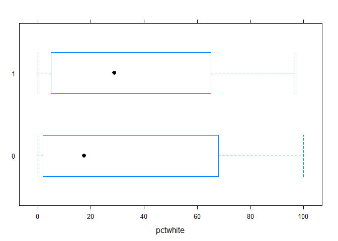
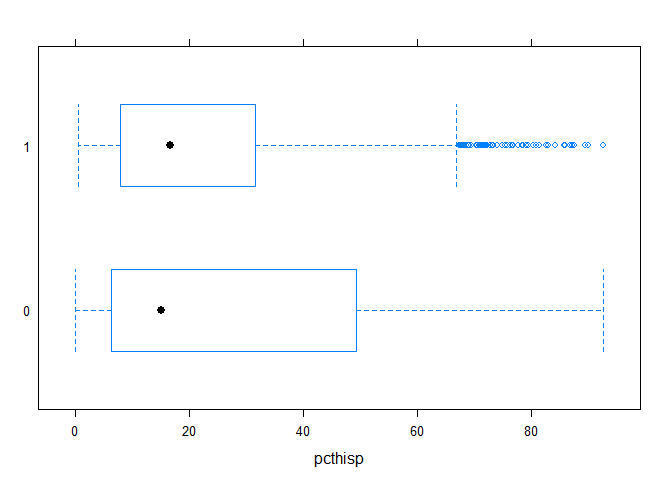
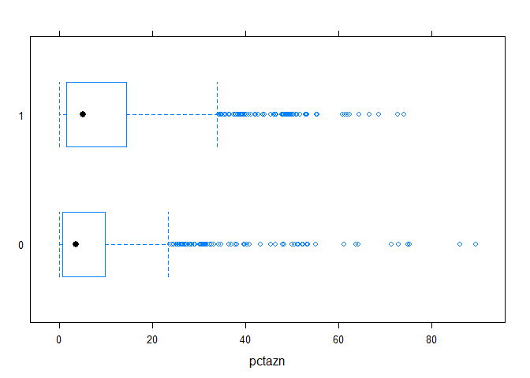
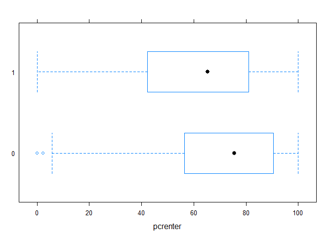
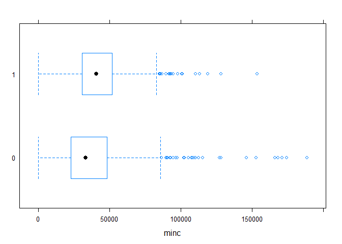

GTECH702 Final Project: Examining Bloomberg-Era Rezonings in New York City
================
Amany Mahfouz
May 2015

> Note: barring minor updates to make sure the code still works, the project presented has not been touched since its completion in 2015. There are several things I would do differently if I were to revisit this, including spending more time exploring the data (many of the variables are not normally distributed); checking that there are linear relationships between the explanatory variables and the logit values (iffy); and narrowing the research question further to focus solely on neighborhood rezonings, rather than all changes to zoning regulation.

### Introduction

Michael Bloomberg's three terms as mayor of New York saw the rezoning of 37% of the city in nearly 400 different zoning map amendments. Many of these rezonings were highly contentious, drawing criticism and protests from people both in favor of and against individual zoning actions. A common claim was that rezonings disproportionately affected low-income and minority communities, increasing the amount of development that could occur there while rezoning higher-income areas to protect them from further development. These claims were substantiated by a report from NYU's Furman Center in 2010. The report found that of the 76 major rezonings between 2003 and 2007, areas that were downzoned or contextually zoned to protect the status quo tended to have higher proportions of homeowners and larger white populations than both upzoned areas and areas that remained unchanged. However, these rezonings represent only a portion of the changes that took place during Bloomberg's time in office, and raise questions about whether these tendencies were consistent through all three terms. In addition, there is also a question of whether rezonings tended to increase or decrease development potential, if they changed it at all.

This project aims to look more broadly at all Bloomberg-era rezonings, examining the relationshps between whether or not a census tract experienced a rezoning and the housing and demographic factors that drew the attention of the Furman Center and people on all sides of the rezoning debate.

### Data

``` r
#import data
setwd("C:/Users/AM/Dropbox/GTECH702")
ct <- read.csv("ct.csv")

#cast factor columns as factors, not numbers
factorcols <- c('CTLabel', 'BoroCode', 'CT2000', 'BoroCT2000', 'PUMA', 'rezoned')
ct[factorcols] <- lapply(ct[factorcols], factor)

#drop tracts where population = 0
ct <- ct[which(ct$pop > 0), ]
```

The data were assembled from a few different sets. The first was a GIS shapefile of New York City census tracts from the Department of City Planning. The second was the census data itself, also culled from the DCP. Keeping with the Furman Center report findings, variables included race percentages, median income, median rent, percent of households that were rent burdened (i.e., those that dedicated more than 30% of their income to housing costs), homemownership rates (here represented in converse by percent of households renting), and poverty rates. Because the 12-year span being studied covered considerable changes in the city, 2000 census figures were used to provide a baseline.

The final data source was a shapefile from the Department of City Planning showing all New York City zoning amendments between January 2002 and present day. All zoning amendments after December 31, 2013, were removed to leave only those approved during Bloomberg's mayoralty. Census tracts intersecting rezoned regions were selected and assigned a value of 1; those that did not intersect a rezoned area were assigned a value of 0. Tracts that were designated park space, such as Central Park and Green-Wood Cemetery, were removed to prevent the lack of population and occasional park building zoning amendment from throwing off results. No distinctions were drawn between tracts that were wholly included in a rezoning plan and tracts that saw only a few lots rezoned, nor between tracts that were upzoned and tracts that were downzoned or that experienced only contextual rezoning. The failure to distinguish between types of zoning changes was largely due to the nature of the data--discerning the change would have required looking up the text of each amendment online, and even then the type of change is not always readily evident. Additionally, inconsistencies in the zoning amendment shapefile may have also caused issues. Rezoning polygons often included slivers or only half-covered building lots, leaving questions as to whether the areas were actually rezoned. While the rezoned tracts were manually checked to exclude slivers and half-lots, there is still a chance some tracts were misclassified.

``` r
summary(ct)
```

    ##     CTLabel     BoroCode          BoroName       CT2000       BoroCT2000  
    ##  39     :   5   1:286    Bronx        :345   3900   :   5   1000201:   1  
    ##  47     :   5   2:345    Brooklyn     :762   4700   :   5   1000202:   1  
    ##  50     :   5   3:762    Manhattan    :286   5000   :   5   1000600:   1  
    ##  65     :   5   4:656    Queens       :656   6500   :   5   1000700:   1  
    ##  75     :   5   5:108    Staten Island:108   7500   :   5   1000800:   1  
    ##  77     :   5                                7700   :   5   1000900:   1  
    ##  (Other):2127                                (Other):2127   (Other):2151  
    ##  CDEligibil    NTACode                    NTANAme          PUMA     
    ##  E:1226     BK50   :  33   Canarsie           :  33   4112   :  87  
    ##  I: 931     BK82   :  30   East New York      :  30   4009   :  79  
    ##             BK31   :  29   Bay Ridge          :  29   4105   :  71  
    ##             BK61   :  29   Crown Heights North:  29   4110   :  65  
    ##             BK58   :  28   Borough Park       :  28   4103   :  61  
    ##             BK88   :  28   Flatlands          :  28   4101   :  59  
    ##             (Other):1980   (Other)            :1980   (Other):1735  
    ##    Shape_Leng       Shape_Area        rezoned       pop       
    ##  Min.   :  2357   Min.   :   298721   0: 859   Min.   :    1  
    ##  1st Qu.:  5565   1st Qu.:  1651212   1:1298   1st Qu.: 2012  
    ##  Median :  6322   Median :  1934362            Median : 3206  
    ##  Mean   :  8148   Mean   :  3428731            Mean   : 3703  
    ##  3rd Qu.:  8095   3rd Qu.:  2684800            3rd Qu.: 4736  
    ##  Max.   :105408   Max.   :194383444            Max.   :24523  
    ##                                                               
    ##      white          pctwhite            blk              pctblk       
    ##  Min.   :    0   Min.   :  0.000   Min.   :    0.0   Min.   :  0.000  
    ##  1st Qu.:   92   1st Qu.:  3.111   1st Qu.:   40.0   1st Qu.:  1.410  
    ##  Median :  657   Median : 25.015   Median :  259.0   Median :  8.815  
    ##  Mean   : 1293   Mean   : 35.365   Mean   :  907.6   Mean   : 26.209  
    ##  3rd Qu.: 1886   3rd Qu.: 66.097   3rd Qu.: 1384.0   3rd Qu.: 47.736  
    ##  Max.   :13450   Max.   :100.000   Max.   :13677.0   Max.   :100.000  
    ##                                                                       
    ##       ndn              pctndn              azn             pctazn      
    ##  Min.   :  0.000   Min.   : 0.00000   Min.   :   0.0   Min.   : 0.000  
    ##  1st Qu.:  1.000   1st Qu.: 0.05122   1st Qu.:  31.0   1st Qu.: 1.139  
    ##  Median :  5.000   Median : 0.14884   Median : 134.0   Median : 4.525  
    ##  Mean   :  8.006   Mean   : 0.23077   Mean   : 360.9   Mean   : 9.353  
    ##  3rd Qu.: 10.000   3rd Qu.: 0.28436   3rd Qu.: 448.0   3rd Qu.:12.537  
    ##  Max.   :134.000   Max.   :17.24138   Max.   :9401.0   Max.   :89.498  
    ##                                                                        
    ##        pi             pctpi             other           pctother      
    ##  Min.   : 0.000   Min.   :0.00000   Min.   :  0.00   Min.   : 0.0000  
    ##  1st Qu.: 0.000   1st Qu.:0.00000   1st Qu.:  4.00   1st Qu.: 0.1629  
    ##  Median : 0.000   Median :0.00000   Median : 12.00   Median : 0.3614  
    ##  Mean   : 1.309   Mean   :0.03597   Mean   : 27.21   Mean   : 0.7735  
    ##  3rd Qu.: 2.000   3rd Qu.:0.04393   3rd Qu.: 27.00   3rd Qu.: 0.7002  
    ##  Max.   :26.000   Max.   :1.40845   Max.   :792.00   Max.   :19.6078  
    ##                                                                       
    ##      mixed            pctmix          hispanic        pcthisp     
    ##  Min.   :   0.0   Min.   : 0.000   Min.   :    0   Min.   : 0.00  
    ##  1st Qu.:  41.0   1st Qu.: 1.477   1st Qu.:  198   1st Qu.: 7.19  
    ##  Median :  76.0   Median : 2.328   Median :  468   Median :16.19  
    ##  Mean   : 104.1   Mean   : 2.952   Mean   : 1000   Mean   :25.08  
    ##  3rd Qu.: 133.0   3rd Qu.: 3.538   3rd Qu.: 1213   3rd Qu.:37.23  
    ##  Max.   :1604.0   Max.   :25.000   Max.   :13391   Max.   :92.65  
    ##                                                                   
    ##      mGRAPI         pcrenter          renter           rburd       
    ##  Min.   : 0.00   Min.   :  0.00   Min.   :   0.0   Min.   :   0.0  
    ##  1st Qu.:24.00   1st Qu.: 46.60   1st Qu.: 336.0   1st Qu.: 134.0  
    ##  Median :27.00   Median : 70.10   Median : 701.0   Median : 288.0  
    ##  Mean   :27.66   Mean   : 65.01   Mean   : 974.9   Mean   : 396.5  
    ##  3rd Qu.:30.00   3rd Qu.: 84.80   3rd Qu.:1298.0   3rd Qu.: 546.0  
    ##  Max.   :50.00   Max.   :100.00   Max.   :8556.0   Max.   :2453.0  
    ##                                                                    
    ##     pcrburd           mrent             minc           povrate      
    ##  Min.   :  0.00   Min.   :   0.0   Min.   :     0   Min.   :  0.00  
    ##  1st Qu.: 34.87   1st Qu.: 640.0   1st Qu.: 27472   1st Qu.:  9.00  
    ##  Median : 40.87   Median : 738.0   Median : 37902   Median : 17.20  
    ##  Mean   : 40.76   Mean   : 747.7   Mean   : 40705   Mean   : 20.42  
    ##  3rd Qu.: 47.35   3rd Qu.: 833.0   3rd Qu.: 51131   3rd Qu.: 28.40  
    ##  Max.   :100.00   Max.   :2001.0   Max.   :188697   Max.   :100.00  
    ## 

``` r
tally(~rezoned, data=ct)
```

    ## rezoned
    ##    0    1 
    ##  859 1298

``` r
tally(rezoned~BoroName, data=ct)
```

    ##        BoroName
    ## rezoned Bronx Brooklyn Manhattan Queens Staten Island
    ##       0   153      397       162    130            17
    ##       1   192      365       124    526            91

An initial exploration the dataset yielded some unexpected results. While 37% of the city's area was subject to zoning amendments between 2002 and 2013, most census tracts had at least one lot rezoned. Queens had the greatest number of census tracts with rezonings, while Staten Island had the highest percentage.

Box plots of different demographics by whether or not a census tract was rezoned suggest there may be meaningful differences between tracts with rezonings and tracts without; the plots can be seen below. There are noticeable differences between rezoned and unchanged tracts in the percent Hispanic and percent Asian boxplots. The percent Hispanic interquartile range is smaller and lower in rezoned tracts, suggesting a negative relationship between Hispanic population concentration and a tract's chances of experiencing a rezoning. The opposite relationship can be seen in the percent Asian box plot; rezoned tracts had a wider and slightly higher interquartile range, suggesting that Asian population might be another explanatory variable worth examining.

While unrezoned tracts had a lower median percent white population that rezoned tracts, their interquartile ranges are largely similar. Box plots for other races not included below also showed scant differences between populations in rezoned versus not rezoned tracts.

``` r
bwplot(rezoned ~ pctwhite, data=ct)
```



``` r
bwplot(rezoned ~ pcthisp, data=ct)
```



``` r
bwplot(rezoned ~ pctazn, data=ct)
```



Box plots were also created for different housing and economic variables versus rezonings. Somewhat surprising is that rezoned areas tended to have higher median incomes and fewer renters. Given the Furman Center findings, this suggests that the majority of census tracts that experienced a rezoning were changed to preserve what was already there, rather than to encourage further development.

``` r
bwplot(rezoned ~ pcrenter, data=ct)
```



``` r
bwplot(rezoned ~ minc, data=ct)
```



### Methods

First, logit models were constructed to explore the relationship between each of the variables looked at in the Furman Center report and whether or not a census tract was rezoned. The relationship between rezoning and white population within a census tract was not significant at the 95% confidence level, as indicated by the coefficient p-value of 0.09; the relationships between rezoning and median income and the percentage of renter households were small but significant at that level, with p-values close to zero. On its own, a $1 increase in a census tract's median income increased the odds that a census tract would be rezoned by 0.0009%; a $1000 increase in a census tract's median income would increase the odds of a given tract's rezoning by 0.9%. The proportion of households renting in a given census tract also affected the odds of rezoning; each additional percentage point decreased the odds of a tract getting rezoned by 1.4%.

``` r
#perhaps the most obvious: how population relates to an area's rezoning
popmod <- glm(rezoned ~ pop, family="binomial", data=ct)
summary(popmod)
```

    ## 
    ## Call:
    ## glm(formula = rezoned ~ pop, family = "binomial", data = ct)
    ## 
    ## Deviance Residuals: 
    ##     Min       1Q   Median       3Q      Max  
    ## -1.5372  -1.3308   0.9179   0.9935   1.5672  
    ## 
    ## Coefficients:
    ##               Estimate Std. Error z value Pr(>|z|)    
    ## (Intercept)  8.150e-01  8.240e-02   9.891  < 2e-16 ***
    ## pop         -1.073e-04  1.842e-05  -5.829 5.56e-09 ***
    ## ---
    ## Signif. codes:  0 '***' 0.001 '**' 0.01 '*' 0.05 '.' 0.1 ' ' 1
    ## 
    ## (Dispersion parameter for binomial family taken to be 1)
    ## 
    ##     Null deviance: 2900.3  on 2156  degrees of freedom
    ## Residual deviance: 2865.3  on 2155  degrees of freedom
    ## AIC: 2869.3
    ## 
    ## Number of Fisher Scoring iterations: 4

``` r
#how median income relates to a tract's chances of getting rezoned
incmod <- glm(rezoned ~ minc, family="binomial", data=ct)
summary(incmod)
```

    ## 
    ## Call:
    ## glm(formula = rezoned ~ minc, family = "binomial", data = ct)
    ## 
    ## Deviance Residuals: 
    ##    Min      1Q  Median      3Q     Max  
    ## -1.960  -1.311   0.947   1.021   1.158  
    ## 
    ## Coefficients:
    ##              Estimate Std. Error z value Pr(>|z|)    
    ## (Intercept) 4.637e-02  1.034e-01   0.449 0.653705    
    ## minc        9.095e-06  2.346e-06   3.877 0.000106 ***
    ## ---
    ## Signif. codes:  0 '***' 0.001 '**' 0.01 '*' 0.05 '.' 0.1 ' ' 1
    ## 
    ## (Dispersion parameter for binomial family taken to be 1)
    ## 
    ##     Null deviance: 2900.3  on 2156  degrees of freedom
    ## Residual deviance: 2884.6  on 2155  degrees of freedom
    ## AIC: 2888.6
    ## 
    ## Number of Fisher Scoring iterations: 4

``` r
#influence of racial makeup (percent white vs minority) on a tract's odds of being rezoned
pctwmod <- glm(rezoned ~ pctwhite, family="binomial", data=ct)
summary(pctwmod)
```

    ## 
    ## Call:
    ## glm(formula = rezoned ~ pctwhite, family = "binomial", data = ct)
    ## 
    ## Deviance Residuals: 
    ##     Min       1Q   Median       3Q      Max  
    ## -1.4236  -1.3267   0.9728   1.0228   1.0401  
    ## 
    ## Coefficients:
    ##             Estimate Std. Error z value Pr(>|z|)    
    ## (Intercept) 0.331908   0.064735   5.127 2.94e-07 ***
    ## pctwhite    0.002304   0.001362   1.692   0.0907 .  
    ## ---
    ## Signif. codes:  0 '***' 0.001 '**' 0.01 '*' 0.05 '.' 0.1 ' ' 1
    ## 
    ## (Dispersion parameter for binomial family taken to be 1)
    ## 
    ##     Null deviance: 2900.3  on 2156  degrees of freedom
    ## Residual deviance: 2897.4  on 2155  degrees of freedom
    ## AIC: 2901.4
    ## 
    ## Number of Fisher Scoring iterations: 4

``` r
#influence of housing occupancy type (renters vs homeowners)
pcrentmod <- glm(rezoned ~ pcrenter, family="binomial", data=ct)
summary(pcrentmod)
```

    ## 
    ## Call:
    ## glm(formula = rezoned ~ pcrenter, family = "binomial", data = ct)
    ## 
    ## Deviance Residuals: 
    ##     Min       1Q   Median       3Q      Max  
    ## -1.8240  -1.2437   0.8159   1.0431   1.2292  
    ## 
    ## Coefficients:
    ##              Estimate Std. Error z value Pr(>|z|)    
    ## (Intercept)  1.453407   0.135610  10.718   <2e-16 ***
    ## pcrenter    -0.015745   0.001903  -8.272   <2e-16 ***
    ## ---
    ## Signif. codes:  0 '***' 0.001 '**' 0.01 '*' 0.05 '.' 0.1 ' ' 1
    ## 
    ## (Dispersion parameter for binomial family taken to be 1)
    ## 
    ##     Null deviance: 2900.3  on 2156  degrees of freedom
    ## Residual deviance: 2828.0  on 2155  degrees of freedom
    ## AIC: 2832
    ## 
    ## Number of Fisher Scoring iterations: 4

However, the significance of median income on the odds of a tract getting rezoned disappeared once combined with percent renters, and the model incorporating both renter rates and median incomes performs about as well as the model using renter rates alone.

``` r
mincrenters <- glm(rezoned ~ minc + pcrenter, family="binomial", data=ct)
summary(mincrenters)
```

    ## 
    ## Call:
    ## glm(formula = rezoned ~ minc + pcrenter, family = "binomial", 
    ##     data = ct)
    ## 
    ## Deviance Residuals: 
    ##    Min      1Q  Median      3Q     Max  
    ## -1.951  -1.241   0.814   1.048   1.304  
    ## 
    ## Coefficients:
    ##               Estimate Std. Error z value Pr(>|z|)    
    ## (Intercept)  1.741e+00  2.480e-01   7.020 2.21e-12 ***
    ## minc        -3.953e-06  2.831e-06  -1.396    0.163    
    ## pcrenter    -1.768e-02  2.369e-03  -7.466 8.29e-14 ***
    ## ---
    ## Signif. codes:  0 '***' 0.001 '**' 0.01 '*' 0.05 '.' 0.1 ' ' 1
    ## 
    ## (Dispersion parameter for binomial family taken to be 1)
    ## 
    ##     Null deviance: 2900.3  on 2156  degrees of freedom
    ## Residual deviance: 2826.1  on 2154  degrees of freedom
    ## AIC: 2832.1
    ## 
    ## Number of Fisher Scoring iterations: 4

I also constructed a model relating rezoning and borough, suspecting that there were other factors relating to geography and the built environment that influenced a census tract's likelihood of experiencing a rezoning. Ultimately this was the strongest of all the single-variable models, with the smallest AIC value and the largest difference between null and residual deviances. Given the by-borough tally of rezoned tracts above, the directions of the coefficients are not particularly relevatory, though it raises questions about the details of and motivations for the rezoning of Staten Island and Queens. Drilling down to a finer granularity with Neighborhood Tabulation Area names produced a model that explained most of the deviance, though unsurprisingly none of the nearly 200 categorical levels were statistically significant at any confidence level.

``` r
boromod <- glm(rezoned ~ BoroName, family="binomial", data=ct)
summary(boromod)
```

    ## 
    ## Call:
    ## glm(formula = rezoned ~ BoroName, family = "binomial", data = ct)
    ## 
    ## Deviance Residuals: 
    ##     Min       1Q   Median       3Q      Max  
    ## -1.9230  -1.1419   0.6646   1.0826   1.2928  
    ## 
    ## Coefficients:
    ##                       Estimate Std. Error z value Pr(>|z|)    
    ## (Intercept)             0.2271     0.1084   2.095  0.03615 *  
    ## BoroNameBrooklyn       -0.3111     0.1304  -2.386  0.01704 *  
    ## BoroNameManhattan      -0.4944     0.1612  -3.067  0.00216 ** 
    ## BoroNameQueens          1.1707     0.1461   8.014 1.11e-15 ***
    ## BoroNameStaten Island   1.4506     0.2856   5.079 3.79e-07 ***
    ## ---
    ## Signif. codes:  0 '***' 0.001 '**' 0.01 '*' 0.05 '.' 0.1 ' ' 1
    ## 
    ## (Dispersion parameter for binomial family taken to be 1)
    ## 
    ##     Null deviance: 2900.3  on 2156  degrees of freedom
    ## Residual deviance: 2667.5  on 2152  degrees of freedom
    ## AIC: 2677.5
    ## 
    ## Number of Fisher Scoring iterations: 4

Controlling for borough ultimately reduced the effects of most of the other explanatory variables. One example of borough rendering another explanatory variable statistically insignificant can be seen below. Percentage of renter households had a significant effect on rezoning in earlier models, but was no longer significant at the 95% confidence level after including boroughs in the model.

``` r
bororenters <-glm(rezoned ~ pcrenter + BoroName, family="binomial", data=ct)
summary(bororenters)
```

    ## 
    ## Call:
    ## glm(formula = rezoned ~ pcrenter + BoroName, family = "binomial", 
    ##     data = ct)
    ## 
    ## Deviance Residuals: 
    ##     Min       1Q   Median       3Q      Max  
    ## -1.9813  -1.1330   0.6387   1.1038   1.3252  
    ## 
    ## Coefficients:
    ##                        Estimate Std. Error z value Pr(>|z|)    
    ## (Intercept)            0.538802   0.205485   2.622  0.00874 ** 
    ## pcrenter              -0.004030   0.002252  -1.789  0.07359 .  
    ## BoroNameBrooklyn      -0.345154   0.131934  -2.616  0.00889 ** 
    ## BoroNameManhattan     -0.476723   0.161581  -2.950  0.00317 ** 
    ## BoroNameQueens         1.067120   0.156767   6.807 9.96e-12 ***
    ## BoroNameStaten Island  1.298766   0.297783   4.361 1.29e-05 ***
    ## ---
    ## Signif. codes:  0 '***' 0.001 '**' 0.01 '*' 0.05 '.' 0.1 ' ' 1
    ## 
    ## (Dispersion parameter for binomial family taken to be 1)
    ## 
    ##     Null deviance: 2900.3  on 2156  degrees of freedom
    ## Residual deviance: 2664.3  on 2151  degrees of freedom
    ## AIC: 2676.3
    ## 
    ## Number of Fisher Scoring iterations: 4

### Results and Discussion

``` r
#the 'best' model in that it had the lowest residual deviance
mod <- glm(rezoned ~ pop + pcthisp + BoroName, family="binomial", data=ct)
summary(mod)
```

    ## 
    ## Call:
    ## glm(formula = rezoned ~ pop + pcthisp + BoroName, family = "binomial", 
    ##     data = ct)
    ## 
    ## Deviance Residuals: 
    ##     Min       1Q   Median       3Q      Max  
    ## -2.1052  -1.1437   0.5963   1.0795   1.7257  
    ## 
    ## Coefficients:
    ##                         Estimate Std. Error z value Pr(>|z|)    
    ## (Intercept)            9.957e-01  1.683e-01   5.918 3.27e-09 ***
    ## pop                   -9.525e-05  2.036e-05  -4.679 2.89e-06 ***
    ## pcthisp               -8.524e-03  2.291e-03  -3.721 0.000198 ***
    ## BoroNameBrooklyn      -6.093e-01  1.469e-01  -4.149 3.33e-05 ***
    ## BoroNameManhattan     -5.601e-01  1.760e-01  -3.182 0.001461 ** 
    ## BoroNameQueens         9.423e-01  1.565e-01   6.023 1.72e-09 ***
    ## BoroNameStaten Island  1.203e+00  2.975e-01   4.043 5.28e-05 ***
    ## ---
    ## Signif. codes:  0 '***' 0.001 '**' 0.01 '*' 0.05 '.' 0.1 ' ' 1
    ## 
    ## (Dispersion parameter for binomial family taken to be 1)
    ## 
    ##     Null deviance: 2900.3  on 2156  degrees of freedom
    ## Residual deviance: 2626.6  on 2150  degrees of freedom
    ## AIC: 2640.6
    ## 
    ## Number of Fisher Scoring iterations: 4

``` r
anova(mod)
```

    ## Analysis of Deviance Table
    ## 
    ## Model: binomial, link: logit
    ## 
    ## Response: rezoned
    ## 
    ## Terms added sequentially (first to last)
    ## 
    ## 
    ##          Df Deviance Resid. Df Resid. Dev
    ## NULL                      2156     2900.3
    ## pop       1   34.983      2155     2865.3
    ## pcthisp   1   14.617      2154     2850.7
    ## BoroName  4  224.089      2150     2626.6

``` r
#check for multicollinearity
vif(mod)
```

    ##              GVIF Df GVIF^(1/(2*Df))
    ## pop      1.094234  1        1.046057
    ## pcthisp  1.268003  1        1.126056
    ## BoroName 1.357876  4        1.038981

``` r
#to check the p-value of the entire model
with(mod, pchisq(null.deviance - deviance, df.null - df.residual, lower.tail=FALSE))
```

    ## [1] 3.5239e-56

Several trials later, the final model was somewhat unexpected. Whether or not a tract was rezoned during the Bloomberg years had most to do with the borough it was in, and as mentioned before, controlling for borough often eliminated the effect of other variables, such as median income or percentage of renter households. The anova test confirms the effect of borough on whether a tract was rezoned; even listed last, borough soaks up most of the deviance. Whether or not a tract was located in Staten Island had the starkest effect on its odds of being rezoned; total population and percent Hispanic population being held equal, a tract in Staten Island would have more than twice the odds of being rezoned than one in the Bronx. The increase in odds due to being in Queens was almost as sharp. Meanwhile, tracts in Brooklyn and Manhattan were actually less likely to experience a rezoning, despite disproportionate media coverage giving the reverse impression.

Absolute population counts had a smaller but still significant effect on a tract's likelihood of being rezoned. Each additional person reduced the odds of a tract being rezoned by about 0.01%. Or, put another way, less populated tracts had a greater likelihood of being rezoned during the Bloomberg years. This makes sense; some of the more noticeable large-scale rezonings occured in areas with lower populations, such as Hudson Yards or the formerly industrial parts of Long Island City. Combined with the borough effect, it also suggests that many zoning changes happened quietly in the less populated portions of Staten Island and Eastern Queens, and these changes were probably downzonings or contextual rezonings. The effect also raises questions about the relationship between population density and rezoning. As the city looks for places to add housing and especially affordable units, less dense and less populated areas can look like ideal places to build up. On the flip side, these can also be regions where residents push for protective rezonings to prevent added density.

Finally, and perhaps most puzzling, the percentage of the population that was Hispanic had a significant effect on a tract's chances of being rezoned; each additional percentage point decreased a tract's odds by 0.85%. Reasons for this remain unclear, but might have to do with other, unaccounted for factors, such as settlement patterns in denser neighborhoods. If some of the reason for this effect is due to collinearity with other model variables, this effect is small, as confirmed by the variance inflation factors below 1.5 for all the included varables.

While the final model and each of its constituent variables are statistically significant at the 95% confidence level, the amount of deviance or variation they explain is on the low side, as can be seen in the somewhat small differences between the null and residual deviances included in the summary. Ultimately, the significance and relatively large coefficients on the categorical borough variable suggest that there are other significant factors affecting whether or not an area was rezoned under the Bloomberg administration, and that these factors have to do with the built environment or are otherwise spatial.

In addtion, market forces and migration trends not accounted for here may have an impact on whether or not an area is rezoned; a neighborhood becoming suddenly "hot" may drive longtime residents to push for a rezoning that slows the rate of change, or it could drive the city and developers to put forth an upzoning to alleviate demand pressures and increase profit potential. Some measure of demographic or housing change, such as change in population totals, diversity, housing values or median rents, could be incorporated to investigate how these effects influence zoning. Other potential explanatory variables to include in future research include some measure of public transit access, which was another variable identified in the Furman Center report.

### Conclusion

The work above represents an initial exploration of the relationships between rezonings and areas' demographic and socioeconomic characteristics. However, the relationships were muddied by not distinguishing between different types of rezonings. The motivations for upzoning are quite different from the motivations for preserving the status quo in an area, as are the actors and affected populations in each case. Future work ought to take into account these differences, drawing a distinction between tracts that were upzoned, downzoned, or contextually rezoned. Additional research could look at other socioeconomic factors; handle time differently; examine only city-initiated rezonings such as the Williamsburg-Greenpoint rezoning; or take into account the number of lots or amount of land affected by rezonings within each tract, as one of the limitations of the binary approach taken here is that all rezonings are considered equal.

The limitations mentioned above mean that this paper cannot confirm or deny many of the claims others have made about the distribution or equity of zoning amendments. Nonetheless these findings can begin to confirm what many in the city already knew: that the rezonings were not evenly distributed, and that certain factors are associated with whether an area saw a rezoning or not. Though most of the attention is paid to Manhattan and Brooklyn, Queens and Staten Island saw their own considerable rezonings, as did less populated areas across the five boroughs. Likewise, though upzonings draw most of the ire, downzonings too have their effect on the city to come.

### Data Sources and References

#### Data

US Census 2000. Tables PL1-D, SF1 H-1, SF3 INC P-1, SF3 POV P-2, SF3 HU H-11, and SF3 HU H-12. <http://www.nyc.gov/html/dcp/html/census/census.shtml>.

New York City Department of City Planning. Zoning Map Amendments (nyzma.shp). <http://www.nyc.gov/html/dcp/html/bytes/dwnzdata.shtml>.

\[The assembled dataset used in this project can be accessed here: <https://docs.google.com/spreadsheets/d/1M_BbWFFyyBXt8YZ1_kAch8y4wq51Od-F-D25Jv8gFDY/edit?usp=sharing>\]

#### References

"The Bloomberg Years: Reshaping New York." New York Times, August 18, 2013. <http://www.nytimes.com/newsgraphics/2013/08/18/reshaping-new-york/>

Furman Center for Real Estate and Urban Policy. "How Have Recent Rezonings Affected the City's Ability to Grow?" 2010. <http://furmancenter.org/files/publications/Rezonings_Furman_Center_Policy_Brief_March_2010.pdf>

Laskow, Sarah. "The quiet, massive rezoning of New York." Capital New York, February 24, 2014. <http://www.capitalnewyork.com/article/city-hall/2014/02/8540743/quiet-massive-rezoning-new-york?page=all>
